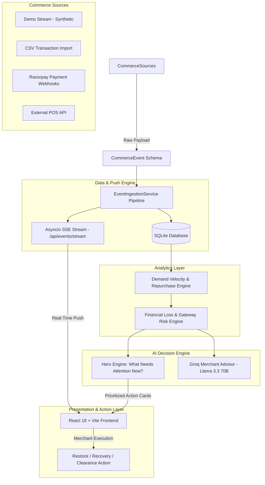

# ShopWise AI — System Architecture

> **AI-Powered Local Commerce Intelligence & Event Ingestion Platform**

ShopWise AI turns merchant transaction, inventory, and payment data into real-time demand, revenue-risk, and merchant decisions.

---

## 1. End-to-End Causal Architecture Flow

---

## 2. Key Architectural Principles

1. **Single-Path Ingestion (`ingestion_service.py`)**: All events route through a single service responsible for validation, database mutation, audit trail logging, and SSE stream broadcasting.
2. **Data Source Isolation (`analytics.py`)**: Source-filtered SQL queries strictly separate synthetic demo events (`DEMO_SIMULATOR`) from imported merchant files (`CSV_IMPORT`) and Razorpay webhooks (`RAZORPAY`).
3. **Real-Time Push Stream (`events.py`)**: SSE endpoint (`GET /api/events/stream`) pushes live transaction payloads directly to the frontend event ticker without polling.
4. **Quantified Financial Decision Engine (`advisor.py`)**: AI decision engine translates demand shifts into Rupees at risk and actionable merchant workflows.
