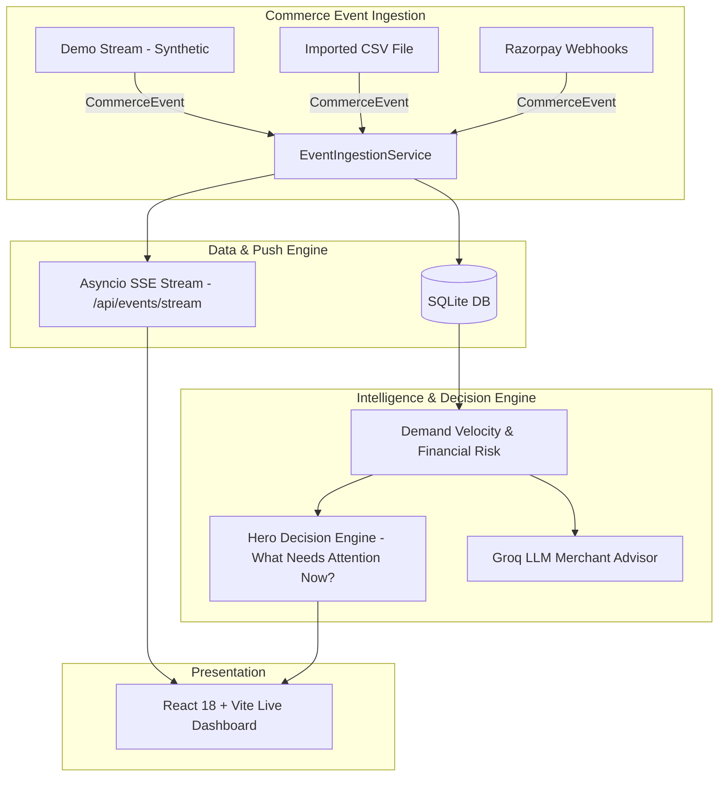

# ShopWise AI

> **"Turn commerce events into real-time demand, revenue-risk, and merchant decisions."**

ShopWise AI is a **Real-Time Commerce Intelligence & Decision Platform** built for the **Razorpay AI Builder Internship Buildathon 2026** (Open Track).

---

## 1. The Causal Intelligence Chain

ShopWise AI transforms raw transactional data into real-time financial decisions through a continuous 5-step causal chain:

```
[ Commerce Event ]
        ↓
[ Demand Signal ]
        ↓
[ Financial Impact ]
        ↓
[ AI Decision Engine ]
        ↓
[ Merchant Action ]
```

1. **Commerce Event**: Raw sales, stock updates, CSV imports, or Razorpay payment failure webhooks enter the ingestion pipeline.
2. **Demand Signal**: Analytics calculates 7-day velocity, demand acceleration %, customer repurchase frequency, and expected repurchase windows.
3. **Financial Impact**: System quantifies potential revenue lost to stockouts (₹) and checkout revenue at risk from payment gateway failures (₹).
4. **AI Decision Engine**: **"WHAT NEEDS ATTENTION NOW?"** engine ranks top prioritized actions (`🔴 RESTOCK`, `🔴 RECOVER`, `🟢 CLEAR`).
5. **Merchant Action**: One-click workflow triggers restock reorders, payment recovery retries, or clearance promotion discounts.

---

## 2. Data Source Honesty & Source Isolation

ShopWise AI strictly isolates data sources to ensure transparency:

- **`LIVE DEMO STREAM`**: Synthetic commerce events generated by the background simulation engine for hackathon evaluation.
- **`IMPORTED MERCHANT DATA`**: Real merchant transaction records uploaded via CSV files (`POST /api/events/upload-csv`).
- **`RAZORPAY TEST EVENTS`**: Real-time payment authorized/failed webhooks ingested via `POST /api/webhooks/razorpay`.
- **`EXTERNAL POS API`**: Transaction payloads posted from point-of-sale systems.

*Synthetic simulation events are strictly tagged as `DEMO_SIMULATOR` and never pollute imported merchant datasets.*

---

## 3. Core Platform Capabilities

### 1. Real-Time Merchant Intelligence Dashboard (`[Merchant Intelligence]`)
- **Real-Time Server-Sent Events (SSE)**: Pushes live events (`GET /api/events/stream`) without page refresh.
- **"WHAT NEEDS ATTENTION NOW?" Hero AI**: Prioritized decision cards with explicit financial impact and **Execute Action Workflow** buttons.
- **30-Minute Time-Series Charts**: Live charts tracking Revenue, Units Sold, and Payment Gateway Success Rate.
- **Customer Repurchase Intelligence**: Tracks unique customer counts, repeat ratios, repurchase intervals, and predicted demand windows.
- **Clickable Product Drilldown**: Interactive modal showing stock timelines, demand velocity, and customer loyalty.

### 2. Consumer Demand Connector (`[Local Discovery]`)
- Natural-language local store search (*"Find fresh Amul milk under ₹70 within 3 km"*).
- Groq intent parsing, ML stockout prediction, Leaflet maps, and OSRM route polylines.

### 3. Inventory Freshness Connector (`[Verify Product]`)
- OCR label scanner extracting MFD/EXP dates, computing remaining shelf life %, and generating clearance alerts.

---

## 4. System Architecture



---

## 5. Running Locally

### Backend Server & SSE Channel
```bash
cd backend
venv\Scripts\activate
$env:PYTHONPATH="backend"
python -m uvicorn app.main:app --host 0.0.0.0 --port 8000
```
- API Docs: `http://localhost:8000/docs`
- SSE Stream: `http://localhost:8000/api/events/stream`

### Frontend UI
```bash
cd frontend
npm install
npm run dev
```
Open `http://localhost:5173/` in your browser.

---

## 6. Verification & Test Suite

```bash
# Run backend pytest suite (26 tests)
$env:PYTHONPATH="backend"; backend\venv\Scripts\python -m pytest backend\tests

# Build frontend production bundle
cd frontend; npm run build
```
